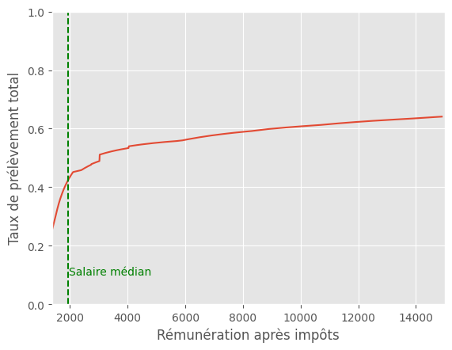

# Prélèvement marginal

## Installation

`poetry install --no-root`

## Analyse

### Définition du taux de prélèvement marginal

L'analyse porte sur le **taux de prélèvement marginal**, ici défini comme la part _marginale_ prélevée par l'état entre le **coût total employeur** et la **rémunération nette après impôts**. Ainsi sont comptés cotisations patronales, les cotisations salariales, et l'impôt sur le revenu.

Par **marginal** on entend ici la part prise sur une somme supplémentaire. Par exemple, si pour 100€ de plus donné par l'employeur, l'employé en touche 40€, le taux de prélèvement marginal est de 60%, ou 0,6.

Le cas d'étude est une personne **célibataire, sans enfant, travaillant à temps plein, sans autre revenu**. On ne prend donc pas en compte les potentielles aides, tel la prime d'activité, ou les allocations logements, qui peuvent se réduire ou s'éliminer avec l'augmentation du revenu. Ceci pourrait augmenter sensiblement le taux de prélèvement marginal sur les faibles revenus.
On ne prend aussi pas en compte des revenus du capital par exemple.

### Vue d'ensemble

On peut voir un graphe du taux de prélèvement marginal entre le SMIC et 15 000€ (à noter que l'échelle est logarithmique).

A part les 3 bonds ponctuels entre 2700€-4000€, le taux marginal est compris entre 0,55 et 0,65. Le taux marginal n'augmente pas particulièrement avec le revenu.

On a rajouté les tranches d'impôts sur le revenu qui peuvent être vus sur le graphe par des bonds. Je ne sais pas pourquoi ils ne coïncident pas exactement.

### Zoom sur les anomalités entre 2700€ et 4000€

Il y a trois anomalités entre 2700€ et 4000€ qui font que le taux marginal de prélèvement est au dessus de 100%, sur des petites fourchettes. Ainsi, sur ces montants, alors que l'employeur augmente l'argent qu'il alloue à un employé, cet employé reçoit moins d'argent.

Les trois anomalies sont dues à l'introduction de prélèvements qui s'appliquent soudainement sur toute l'assiette :

- Avec le "Plafond de Sécurité Sociale" (~2720€/mois nets après impôts, 46368€/an brut), il y a l'introduction de la contribution à l'équilibre général (0.21%+0.14% supplémentaires sur toute l'assiette).
- À 2.5 SMIC bruts (~3030€ nets après impôts, 4375€ mensuels brut, ~52500€ annuels brut), les cotisations employeurs de l'assurance maladie passent du taux réduit à 7% au taux plein qui est de 13% -- et ce sur toute l'assiette. Ainsi, en dépassant ce seuil de 1€ sur le brut, on obtient un surcrois d'environ 270€ de prélèvements.
- À 3.5 SMIC bruts (~4030€ nets après impôts, 6125€ mensuels brut, 73500€ annuels brut), oû les allocations familiales passent du taux réduit à 3.45% à 5.25%. On a donc une regressivité sur environ 110€.

### Taux total de prélèvement

On peut voir un graphe du taux total de prélèvement entre le SMIC et 15 000€/mois.

